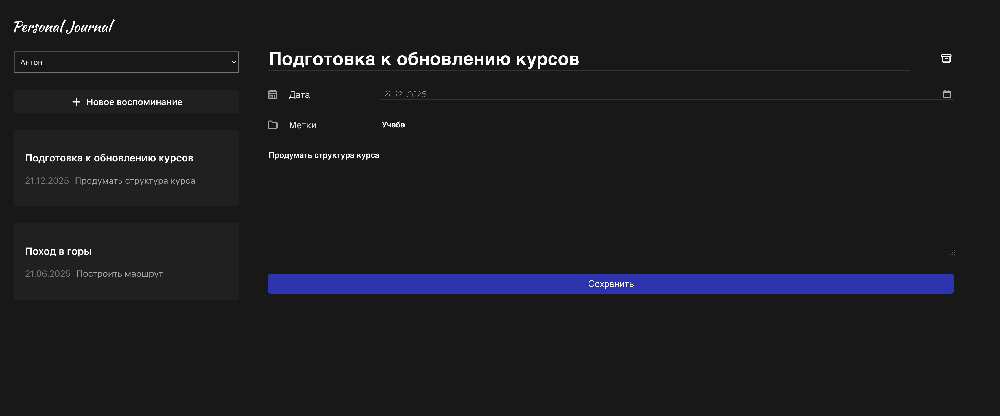

# Приложение для ведения заметок
Приложение для ведения заметок с возможностью создания, редактирования и удаления с сортировкой по дате. Поддерживается использование нескольких пользователей, у каждого свой список заметок. Данные хранятся в local storage.



## Содержание
- [Технологии](#технологии)
- [Начало работы](#начало-работы)

## Технологии
- [React](https://react.dev/)
- [Vite](https://vitejs.dev/)

## Начало работы

### Требования
Для установки и запуска проекта, необходим [NodeJS](https://nodejs.org/).

### Установка зависимостей
Для установки зависимостей, выполните команду в папке с проектом:
```sh
$ npm i
```

### Запуск Development сервера
Чтобы запустить сервер для разработки, выполните команду в папке с проектом:
```sh
npm run dev
```
После запуска появится данные. Нам нужно поле "Local:", переходим по указанной в нем ссылке и пользуемся приложением.

